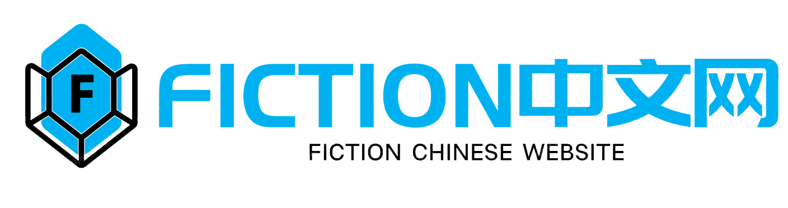

## 项目简介

本系统是一个完整的 **在线小说网站解决方案**，由三个彼此解耦又紧密协作的子项目组成：

- **前端站点：`ad-fiction-front`**
  - 技术栈：Vue3 + Vite + Element Plus + Pinia + Axios。
  - 负责：小说首页、详情、阅读、分类、排行、搜索、书架、评论、登录/个人中心等可视化页面。

- **后端服务：`fiction`**
  - 技术栈：Spring Boot 2.7.11 + MyBatis-Plus + MySQL + Redis + Sa-Token + Druid + x-file-storage + WebDAV。
  - 负责：对外 REST API、业务逻辑处理、登录与权限、缓存、文件存储对接。

- **爬虫采集：`fiction_spider`**
  - 技术栈：Scrapy + PyMySQL + webdav4 + requests。
  - 负责：从第三方小说站（如奇书网）批量采集小说及章节内容，写入 MySQL，并可将 txt/封面同步到 WebDAV。

整体形成：**数据采集 → 数据存储 → 服务接口 → 前端展示** 的闭环，既能快速搭建自己的小说站点，也可以作为一套学习/演示级的「全栈 + 爬虫」综合项目。

---

## 总体架构图

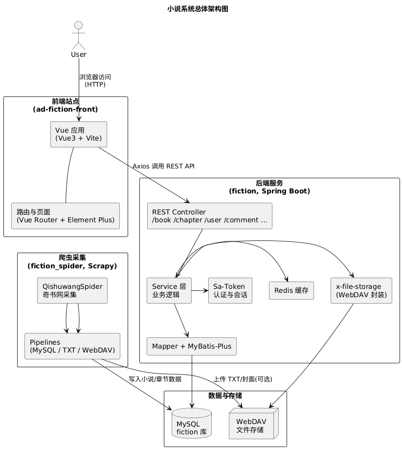

---

## 开发接口说明

https://docs.apipost.net/docs/2d7a593fb864000?locale=zh-cn

## 系列开发笔记

[fiction中文网前端代码分析 | ad博客](https://blog.aiheadn.cn/archives/806da430.html)

[fiction中文网后端代码分析 | ad博客](https://blog.aiheadn.cn/archives/47e3ed5a.html)

[fiction中文网爬虫代码分析 | ad博客](https://blog.aiheadn.cn/archives/33410d32.html)

~~[fiction中文网flutter代码分析 | ad博客](https://blog.aiheadn.cn/archives/b701ad99.html) 该子项目开发失败 已放弃~~

## ad-fiction-front 前端项目说明

本项目是整套小说系统的 **Web 前端**，基于 **Vue3 + Vite + Element Plus**，对接后端 `fiction` 提供的 REST 接口，展示小说列表、详情、阅读、分类、排行、书架、搜索、登录等功能页面。

---

### 项目预览图


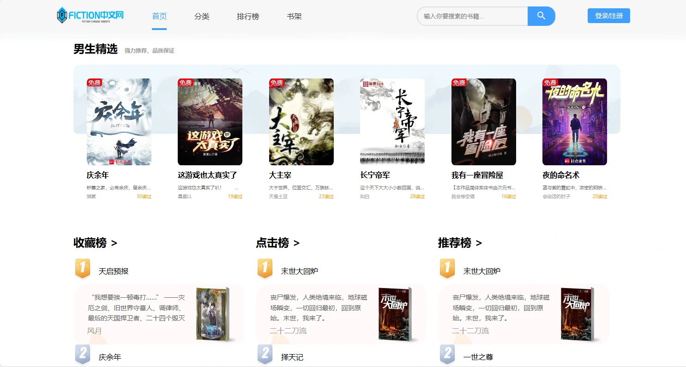

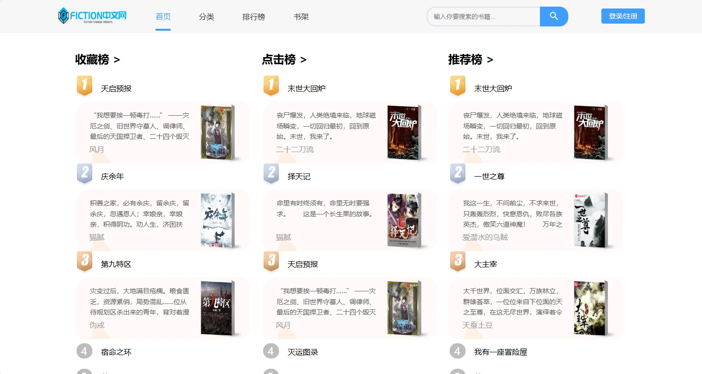


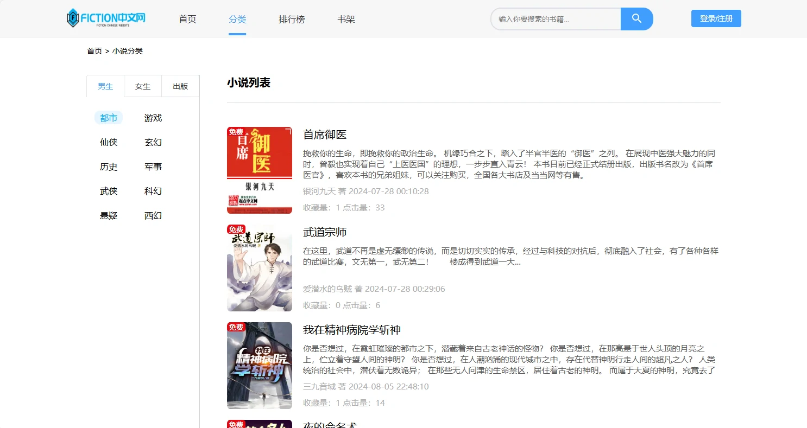

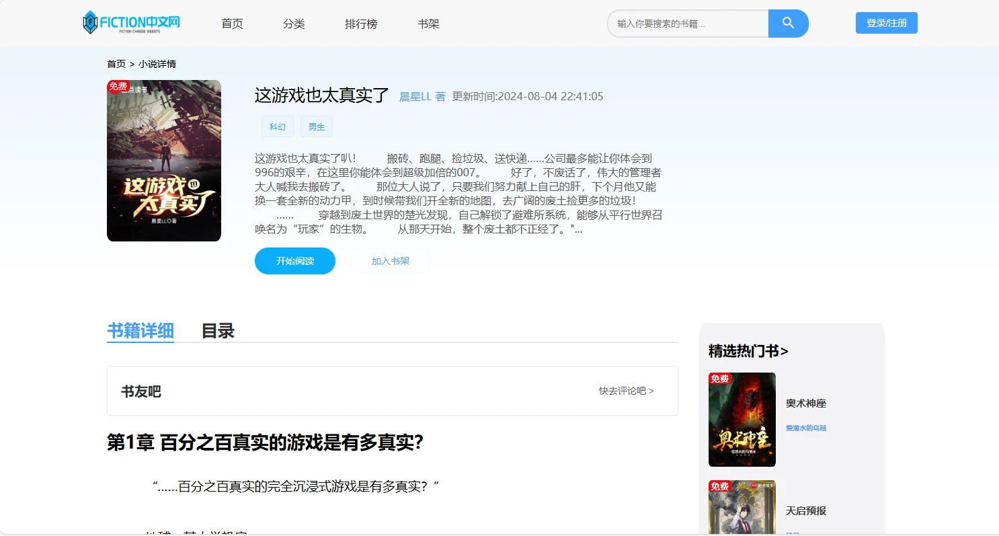

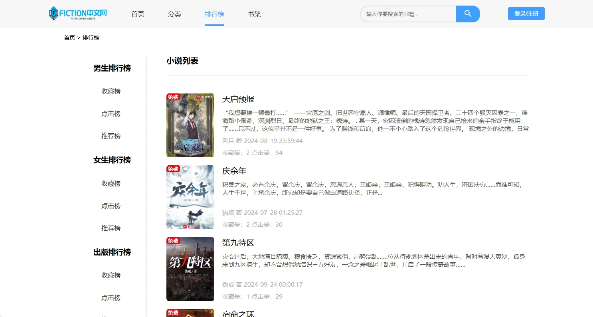

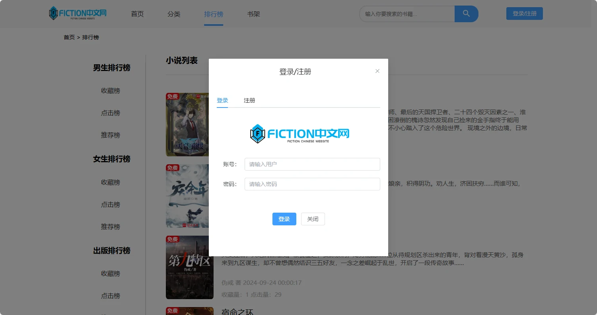

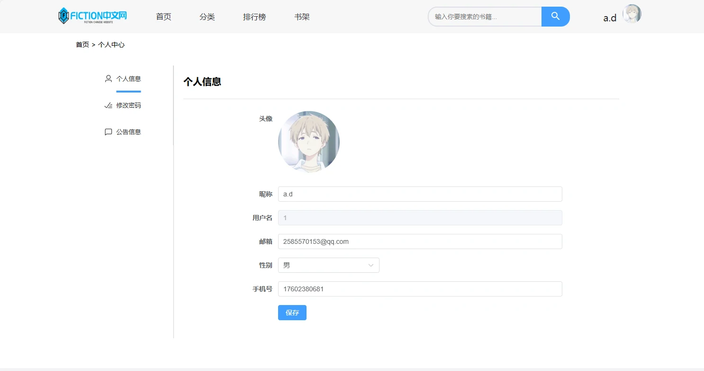

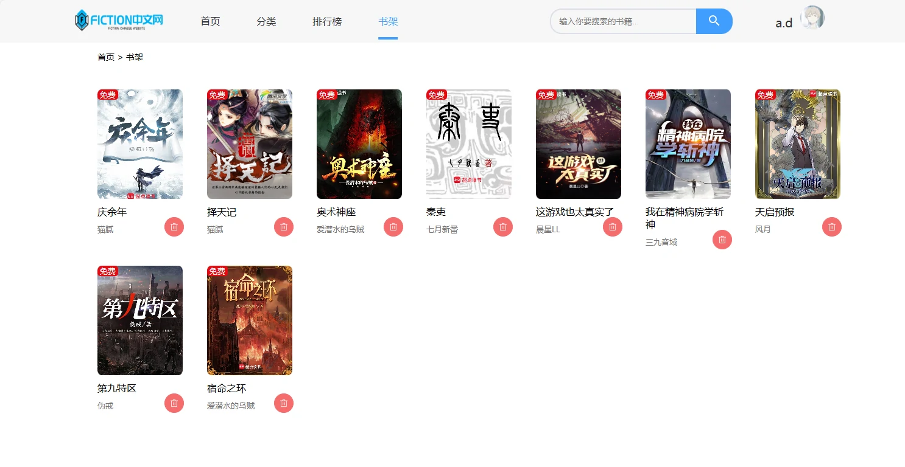

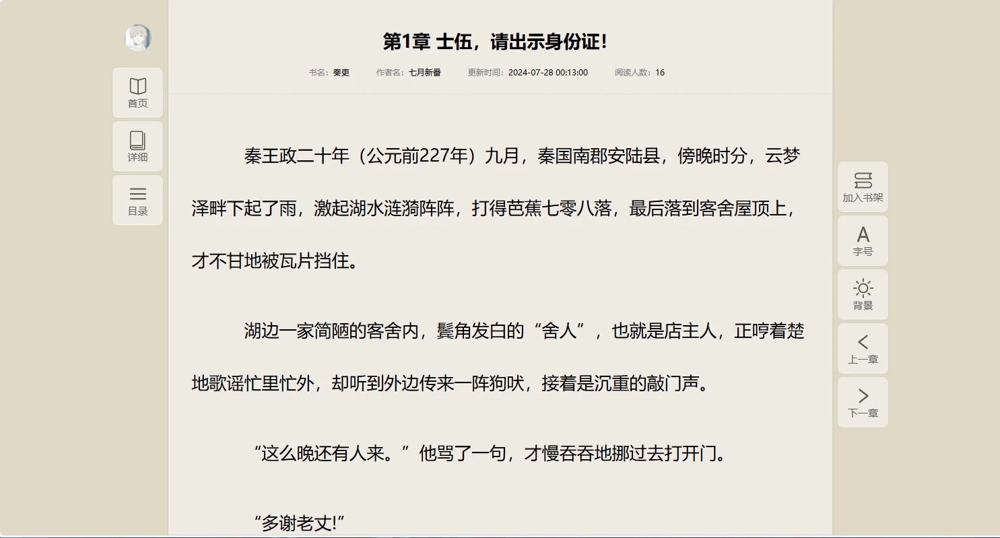

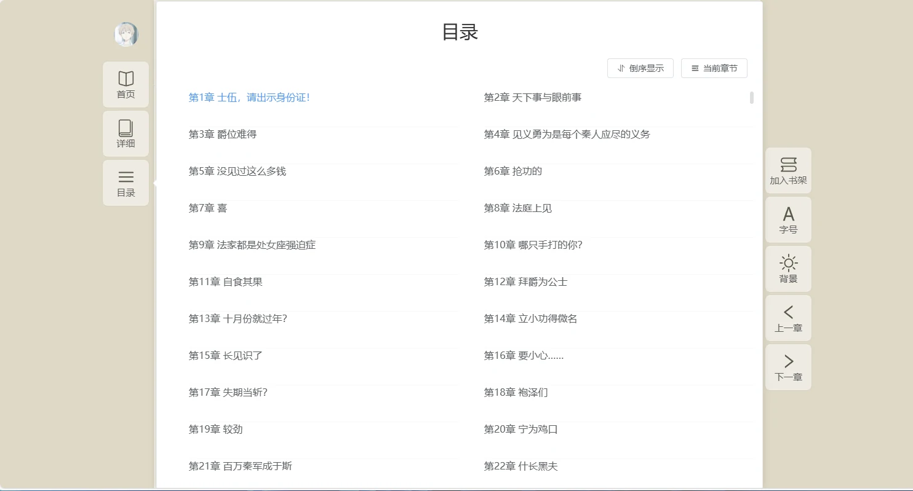

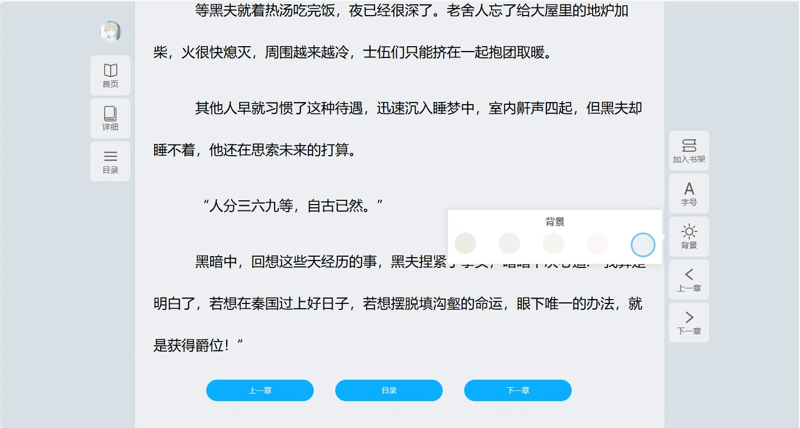

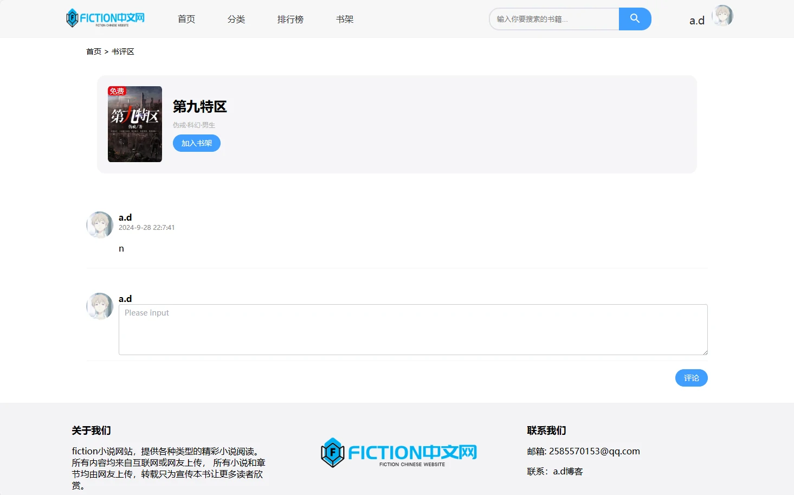

## 技术栈

- **框架**：Vue 3  
- **构建工具**：Vite  
- **路由**：Vue Router 4  
- **状态管理**：Pinia + `pinia-plugin-persistedstate`  
- **UI 组件库**：Element Plus  
- **网络请求**：Axios  
- **辅助库**：`vue-lazyload`、`responsive-storage`、SCSS

## 目录结构概览

```text
ad-fiction-front/
├─ public/                 # 公共静态资源
├─ src/
│  ├─ apis/                # 后端接口封装（小说、章节、评论、搜索、用户等）
│  ├─ assets/              # 图标、图片（含 iconfont）
│  ├─ components/          # 通用组件（如页脚、SvgIcon、移动端路由组件等）
│  ├─ enums/               # 枚举配置
│  ├─ mobile/              # 移动端入口页面
│  ├─ router/              # 路由配置
│  ├─ stores/              # Pinia Store（如阅读相关状态）
│  ├─ styles/              # 全局样式、主题变量、Element Plus 覆盖样式
│  ├─ utils/               # Axios 封装等工具函数
│  ├─ views/               # 各业务页面（详情、阅读、分类、排行、书架、搜索、评论、登录等）
│  ├─ App.vue              # 根组件
│  └─ main.js              # 入口文件
└─ vite.config.js          # Vite 配置
```

---

## 路由与主要页面

路由定义位于 `src/router/index.js`，核心路径包括：

- `/`：首页布局 `Layout`  
- `/detail/:id`：小说详情页  
- `/read/:tableName/:fictionId/:id`：阅读页（根据表名 + 小说ID + 章节ID）  
- `/category/:bigclass/:id/:classify?`：分类页面  
- `/rankinglist/:bigclass/:id/:rankinglist`：排行榜页面  
- `/bookrank`：书架  
- `/search/:name/:id`：搜索结果  
- `/login`：登录页面  
- `/info`：个人信息页面  
- `/comment/:id`：评论页面  
- `/mobile`：移动端专用页面  
- `/test`：测试页面  

路由守卫中根据 `navigator.userAgent` 设置 `to.meta.isMobile`，用于区分移动端/PC，部分页面可据此做适配。

---

## 与后端的对接

- 所有接口统一通过 `src/utils/http.js` 中封装的 Axios 实例发起请求。  
- 具体接口划分在 `src/apis` 下，如 `bannerAPI.js`、`bookrankAPI.js`、`chapterAPI.js`、`fictionAPI.js`、`searchAPI.js`、`userAPI.js` 等。  
- **重要**：请将 Axios 的 Base URL 配置为后端 `fiction` 的访问地址，例如：
  - 开发环境：`http://localhost:8080`
  - 生产环境：你的后端实际部署域名

---

## 本地开发与构建

确保已经安装 Node.js（推荐 16+）和 npm

```bash
cd ad-fiction-front

# 安装依赖
npm install

# 开发环境启动（默认端口一般为 5173）
npm run dev

# 生产构建
npm run build

# 本地预览打包结果
npm run preview
```

启动后在浏览器访问 Vite 输出的地址（通常是 `http://localhost:5173`），即可通过前端访问后端接口，查看小说列表、详情与阅读等功能。

---

## 部署建议

- **与后端分离部署**  
  - 将 `npm run build` 生成的 `dist/` 上传到任意静态资源服务器（如 Nginx、OSS、CDN 等）。  
  - 前端通过域名访问静态资源，Axios 指向后端部署地址。  

- **与后端一体部署**  
  - 将 `dist/` 构建产物复制到后端 `fiction` 项目的静态资源目录（如 `src/main/resources/static`）。  
  - 通过 Nginx 或 Spring Boot 内置静态资源能力统一对外提供服务，实现前后端一体化部署。  

---

## 常见开发修改点

- **接口环境切换**：在 `http.js` 或相关配置文件中切换后端 Base URL。  
- **主题/样式调整**：在 `src/styles/var.scss` 和 `src/styles/element/index.scss` 中调色和组件样式。  
- **新增页面**：在 `src/views` 中创建新页面组件，并在 `src/router/index.js` 中注册路由即可。  
